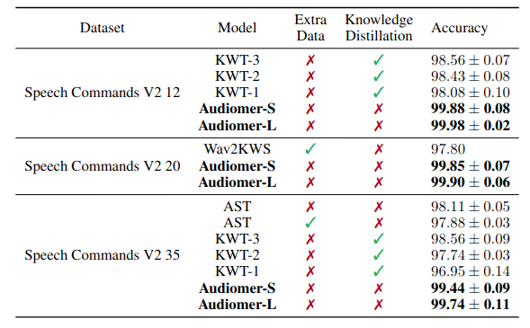
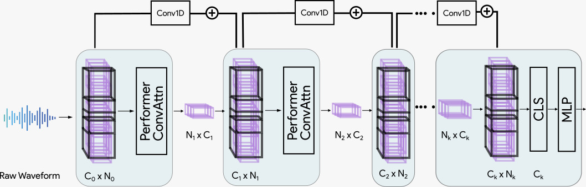
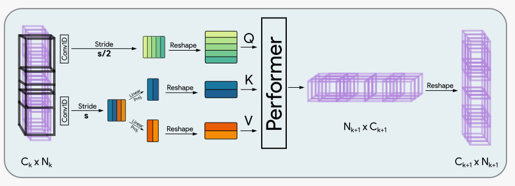

<div align="center">


<samp>


# ☢️ Audiomer ☢️ 

</samp>
  
Audiomer: A Convolutional Transformer for Keyword Spotting

| **[ [```arXiv```](<https://arxiv.org/abs/2109.10252>) ]** | **[ [```Previous SOTA```](<https://github.com/ARM-software/keyword-transformer>) ]** |**[ [```Model Architecture```](<assets/Audiomer.jpeg>) ]** |
|:-------------------:|:-------------------:|:-------------------:|

<br>
<samp>

<h2> Results on SpeechCommands </h2>

</samp> 



<samp>

<h2> Model Architecture </h2>

</samp> 
  


<samp>

<h2> Performer Conv-Attention </h2>

</samp>   
  


---  
  
</div>

## Usage
  To reproduce the results in the paper, follow the instructions:

- To download the Speech Commands v2 dataset, run: `python3 datamodules/SpeechCommands12.py`
- To train Audiomer-S and Audiomer-L on all three datasets thrice, run: `python3 run_expts.py`
- To evaluate a model on a dataset, run: `python3 evaluate.py --checkpoint_path /path/to/checkpoint.ckpt --model <model type> --dataset <name of dataset>`.
- For example: `python3 evaluate.py --checkpoint_path ./epoch=300.ckpt --model S --dataset SC20`

## System requirements
- NVIDIA GPU with CUDA
- Python 3.6 or higher.
- pytorch_lightning
- torchaudio
- performer_pytorch
